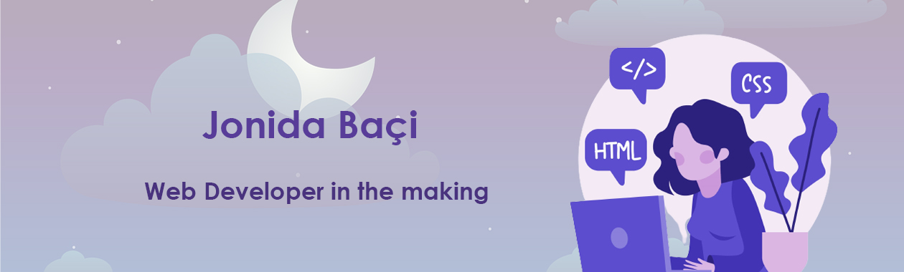

### Hello there, I'm Jonida - aka Nida 👋

## Happy to see you here!!

- ✨ I’m 22, a web developement enthusiast and I am currently learning everything I can
- 🤍 I’m looking to collaborate with other content creators
- ✨ My 2022 Goals: Contribute more to Open Source projects and get better at JS
- 🤍 Fun fact: I love puzzles, video games and good music
  

### Connect with me: 

[][twitter] 
[][linkedin]

   

### Let's play together:

[][cssbattle] 
 

### Languages and Tools:

[][html]
[][css]
[][js]
[][sass]
[][bs] 
[][react]
[][git]
[][github]
[][vs]

 
 

[bs]:https://getbootstrap.com/
[twitter]: https://twitter.com/NidaBaci514
[linkedin]: https://www.linkedin.com/in/jonida-baci99
[github]: https://github.com/nidabaci
[vs]: https://visualstudio.microsoft.com/
[html]: https://developer.mozilla.org/en-US/docs/Web/HTML
[css]:https://developer.mozilla.org/en-US/docs/Web/CSS
[sass]: https://sass-lang.com/
[js]: https://developer.mozilla.org/en-US/docs/Web/JavaScript
[git]:https://git-scm.com/
[github]:https://github.com/nidabaci
[react]: https://reactjs.org/
[cssbattle]:https://cssbattle.dev/player/nidabaci

<!-- a comment -->
